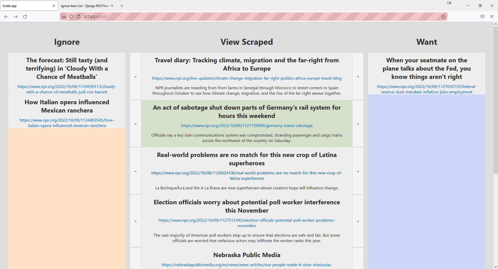
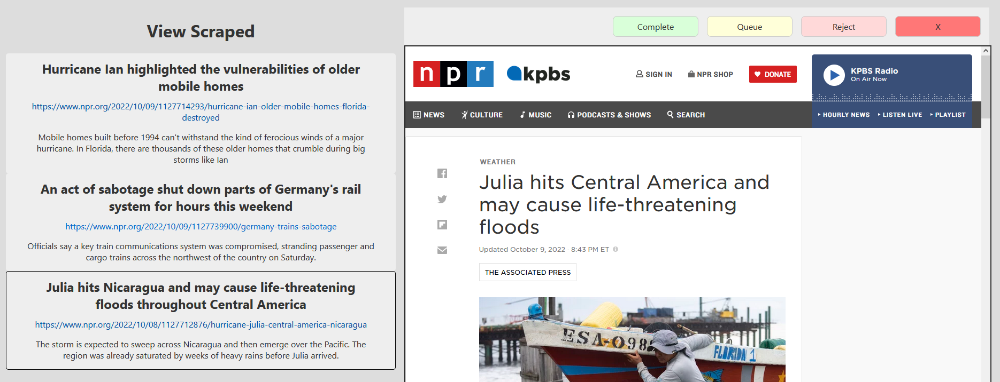

# View Scraped
Web app built with svelte, django, and postgres to easily view database objects. Uses routify for multiple svelte pages with everything served by django.

I was tired of having to juggle around csvs and reading scraped data in table form in spreadsheet programs.

So I created a GUI that would present my data better and let me record my decisions with a single click. I used iframes to have the option of get a deeper view of the data. 

I also decided I needed a second page with greater emphasis on iframes and to add a second level of decision making.

