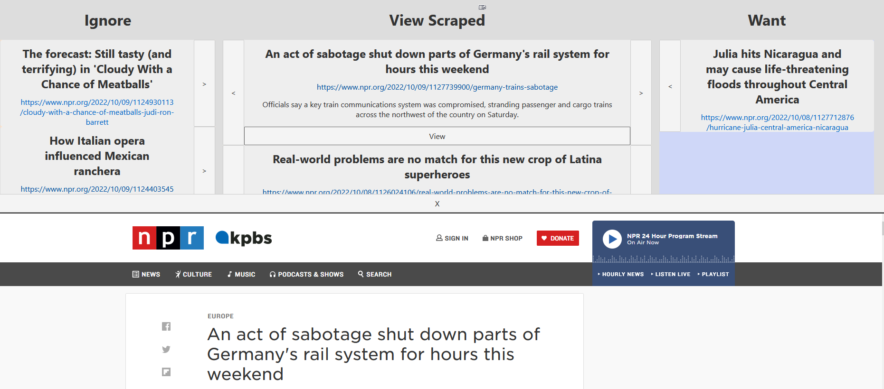

# View Scraped
Web app built with svelte, django, and postgres to easily view database objects

I was tired of having to juggle around csvs and reading scraped data in table form in spreadsheet programs. I created a GUI that would present my data better and let me record my decisions with a single click.

